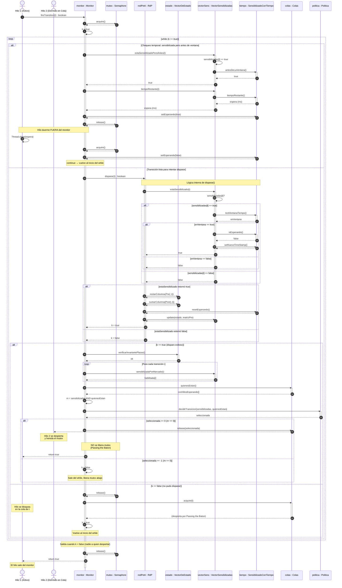

```mermaid
sequenceDiagram
    autonumber
    actor hilo1 as Hilo 1 (Activo)
    actor hilo2 as Hilo 2 (Dormido en Cola)
    participant m as monitor : Monitor
    participant mutex as mutex : Semaphore
    participant rdp as redPetri : RdP
    participant ve as estado : VectorDeEstado
    participant vs as vectorSens : VectorSensibilizadas
    participant sct as tiempo : SensibilizadoConTiempo
    participant colas as colas : Colas
    participant pol as politica : Politica

    hilo1 ->> m: fireTransition(t) : boolean
    activate m
    m ->> mutex: acquire()
    activate mutex
    mutex -->> m: 
    deactivate mutex
    m ->> m: k = true

    loop while (k == true)

        alt Chequeo temporal: sensibilizada pero antes de ventana
            m ->> vs: estaSensibilizadoPeroAntes(t)
            activate vs
            vs ->> vs: sensibilizadas[t] == true
            vs ->> sct: antesDeLaVentana()
            activate sct
            sct -->> vs: true
            deactivate sct
            vs -->> m: true
            deactivate vs

            m ->> vs: tiempoRestante(t)
            activate vs
            vs ->> sct: tiempoRestante()
            activate sct
            sct -->> vs: espera (ms)
            deactivate sct
            vs -->> m: espera (ms)
            deactivate vs

            m ->> sct: setEsperando(true)
            activate sct
            sct -->> m: 
            deactivate sct

            m ->> mutex: release()
            activate mutex
            mutex -->> m: 
            deactivate mutex

            Note over hilo1, m: Hilo duerme FUERA del monitor

            hilo1 ->> hilo1: Thread.sleep(espera)

            m ->> mutex: acquire()
            activate mutex
            mutex -->> m: 
            deactivate mutex

            m ->> sct: setEsperando(false)
            activate sct
            sct -->> m: 
            deactivate sct

            Note over m: continue → vuelve al inicio del while

        else Transición lista para intentar disparar

            m ->> rdp: disparar(t) : boolean
            activate rdp

            Note over rdp, sct: Lógica interna de disparar()

            rdp ->> vs: estaSensibilizado(t)
            activate vs
            vs ->> vs: sensibilizadas[t]?

            alt sensibilizadas[t] == true
                vs ->> sct: testVentanaTiempo()
                activate sct
                sct -->> vs: enVentana
                deactivate sct

                alt enVentana == true
                    vs ->> sct: isEsperando()
                    activate sct
                    sct -->> vs: false
                    deactivate sct
                    vs ->> sct: setNuevoTimeStamp()
                    activate sct
                    sct -->> vs: 
                    deactivate sct
                    vs -->> rdp: true
                else enVentana == false
                    vs -->> rdp: false
                end
            else sensibilizadas[t] == false
                vs -->> rdp: false
            end
            deactivate vs

            alt estaSensibilizado retornó true
                rdp ->> ve: restarColumna(Pre(:,t))
                activate ve
                ve -->> rdp: 
                deactivate ve
                rdp ->> ve: sumarColumna(Post(:,t))
                activate ve
                ve -->> rdp: 
                deactivate ve
                rdp ->> sct: resetEsperando()
                activate sct
                sct -->> rdp: 
                deactivate sct
                rdp ->> vs: update(estado, matrizPre)
                activate vs
                vs -->> rdp: 
                deactivate vs
                rdp -->> m: k = true
            else estaSensibilizado retornó false
                rdp -->> m: k = false
            end
            deactivate rdp

            alt k == true (disparo exitoso)

                m ->> ve: verificarInvariantePlazas()
                activate ve
                ve -->> m: ok
                deactivate ve

                loop Para cada transición i
                    m ->> vs: sensibilizadaPorMarcado(i)
                    activate vs
                    vs -->> m: habilitada[i]
                    deactivate vs
                end

                m ->> colas: quienesEstan()
                activate colas
                colas -->> m: conHilosEsperando[]
                deactivate colas

                m ->> m: m = sensibilizadas AND quienesEstan

                m ->> pol: decidirTransicion(sensibilizadas, quienesEstan)
                activate pol
                pol -->> m: seleccionada
                deactivate pol

                alt seleccionada >= 0 (m <> 0)
                    m ->> colas: release(seleccionada)
                    activate colas
                    colas -->> hilo2: 
                    deactivate colas
                    Note over hilo2: Hilo 2 se despierta<br/>y hereda el mutex
                    Note over m, mutex: NO se libera mutex<br/>(Passing the Baton)
                    m -->> hilo1: return true

                else seleccionada == -1 (m == 0)
                    m ->> m: k = false
                    Note over m: Sale del while, libera mutex abajo
                end

            else k == false (no pudo disparar)
                m ->> mutex: release()
                activate mutex
                mutex -->> m: 
                deactivate mutex

                m ->> colas: acquire(t)
                activate colas
                Note over hilo1: Hilo se bloquea<br/>en la cola de t
                colas -->> m: (despierta por Passing the Baton)
                deactivate colas

                m ->> m: k = true
                Note over m: Vuelve al inicio del while
            end
        end
    end

    Note over m: Salida cuando k = false (nadie a quien despertar)
    m ->> mutex: release()
    activate mutex
    mutex -->> m: 
    deactivate mutex

    m -->> hilo1: return true
    Note over hilo1: El hilo sale del monitor
    deactivate m
```