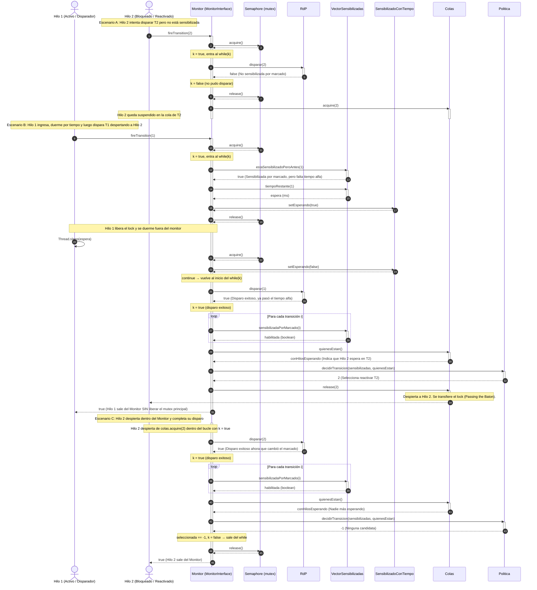

```mermaid
sequenceDiagram
    autonumber
    actor hilo1 as Hilo 1 (Activo / Disparador)
    actor hilo2 as Hilo 2 (Bloqueado / Reactivado)
    participant m as Monitor (MonitorInterface)
    participant mutex as Semaphore (mutex)
    participant rdp as RdP
    participant vs as VectorSensibilizadas
    participant sct as SensibilizadoConTiempo
    participant colas as Colas
    participant pol as Politica

    Note over hilo2: Escenario A: Hilo 2 intenta disparar T2 pero no está sensibilizada
    hilo2->>m: fireTransition(2)
    activate m
    m->>mutex: acquire()
    activate mutex
    mutex-->>m: 
    deactivate mutex

    Note over m: k = true, entra al while(k)
    
    m->>rdp: disparar(2)
    activate rdp
    rdp-->>m: false (No sensibilizada por marcado)
    deactivate rdp
    
    Note over m: k = false (no pudo disparar)
    m->>mutex: release()
    activate mutex
    mutex-->>m: 
    deactivate mutex
    
    m->>colas: acquire(2)
    activate colas
    Note over hilo2: Hilo 2 queda suspendido en la cola de T2
    deactivate colas
    deactivate m

    Note over hilo1: Escenario B: Hilo 1 ingresa, duerme por tiempo y luego dispara T1 despertando a Hilo 2
    hilo1->>m: fireTransition(1)
    activate m
    m->>mutex: acquire()
    activate mutex
    mutex-->>m: 
    deactivate mutex

    Note over m: k = true, entra al while(k)
    
    m->>vs: estaSensibilizadoPeroAntes(1)
    activate vs
    vs-->>m: true (Sensibilizada por marcado, pero falta tiempo alfa)
    deactivate vs
    
    m->>vs: tiempoRestante(1)
    activate vs
    vs-->>m: espera (ms)
    deactivate vs

    m->>sct: setEsperando(true)
    activate sct
    sct-->>m: 
    deactivate sct
    
    m->>mutex: release()
    activate mutex
    mutex-->>m: 
    deactivate mutex
    
    Note over hilo1, m: Hilo 1 libera el lock y se duerme fuera del monitor
    hilo1->>hilo1: Thread.sleep(espera)
    
    m->>mutex: acquire()
    activate mutex
    mutex-->>m: 
    deactivate mutex

    m->>sct: setEsperando(false)
    activate sct
    sct-->>m: 
    deactivate sct

    Note over m: continue → vuelve al inicio del while(k)
    
    m->>rdp: disparar(1)
    activate rdp
    rdp-->>m: true (Disparo exitoso, ya pasó el tiempo alfa)
    deactivate rdp
    
    Note over m: k = true (disparo exitoso)

    loop Para cada transición i
        m->>vs: sensibilizadaPorMarcado(i)
        activate vs
        vs-->>m: habilitada (boolean)
        deactivate vs
    end

    m->>colas: quienesEstan()
    activate colas
    colas-->>m: conHilosEsperando (Indica que Hilo 2 espera en T2)
    deactivate colas
    
    m->>pol: decidirTransicion(sensibilizadas, quienesEstan)
    activate pol
    pol-->>m: 2 (Selecciona reactivar T2)
    deactivate pol
    
    m->>colas: release(2)
    activate colas
    Note over colas: Despierta a Hilo 2. Se transfiere el lock (Passing the Baton).
    colas-->>hilo2: 
    deactivate colas
    
    m-->>hilo1: true (Hilo 1 sale del Monitor SIN liberar el mutex principal)
    deactivate m

    Note over hilo2: Escenario C: Hilo 2 despierta dentro del Monitor y completa su disparo
    activate m
    Note over hilo2, m: Hilo 2 despierta de colas.acquire(2) dentro del bucle con k = true
    
    m->>rdp: disparar(2)
    activate rdp
    rdp-->>m: true (Disparo exitoso ahora que cambió el marcado)
    deactivate rdp
    
    Note over m: k = true (disparo exitoso)

    loop Para cada transición i
        m->>vs: sensibilizadaPorMarcado(i)
        activate vs
        vs-->>m: habilitada (boolean)
        deactivate vs
    end

    m->>colas: quienesEstan()
    activate colas
    colas-->>m: conHilosEsperando (Nadie más esperando)
    deactivate colas
    
    m->>pol: decidirTransicion(sensibilizadas, quienesEstan)
    activate pol
    pol-->>m: -1 (Ninguna candidata)
    deactivate pol
    
    Note over m: seleccionada == -1, k = false → sale del while
    m->>mutex: release()
    activate mutex
    mutex-->>m: 
    deactivate mutex
    
    m-->>hilo2: true (Hilo 2 sale del Monitor)
    deactivate m
```