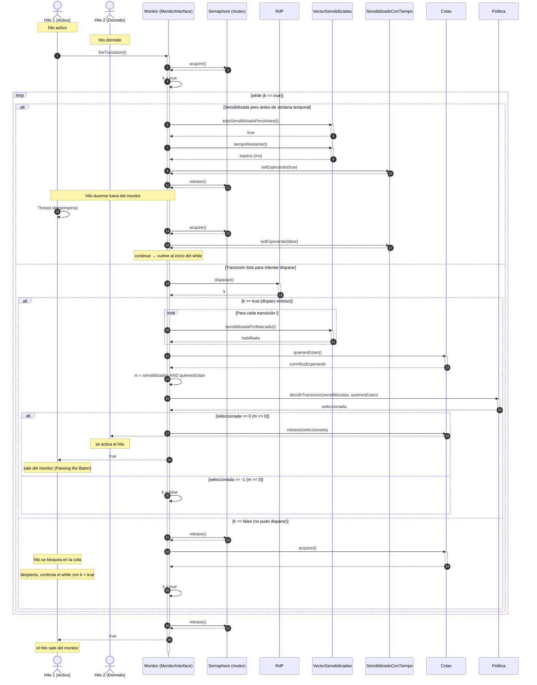

```mermaid
sequenceDiagram
    autonumber
    actor hilo1 as Hilo 1 (Activo)
    actor hilo2 as Hilo 2 (Dormido)
    participant m as Monitor (MonitorInterface)
    participant mutex as Semaphore (mutex)
    participant rdp as RdP
    participant vs as VectorSensibilizadas
    participant sct as SensibilizadoConTiempo
    participant colas as Colas
    participant pol as Politica

    Note over hilo1: hilo activo
    Note over hilo2: hilo dormido

    hilo1->>m: fireTransition(t)
    activate m
    m->>mutex: acquire()
    activate mutex
    mutex-->>m: 
    deactivate mutex
    m->>m: k = true

    loop while (k == true)
        alt Sensibilizada pero antes de ventana temporal
            m->>vs: estaSensibilizadoPeroAntes(t)
            activate vs
            vs-->>m: true
            deactivate vs

            m->>vs: tiempoRestante(t)
            activate vs
            vs-->>m: espera (ms)
            deactivate vs

            m->>sct: setEsperando(true)
            activate sct
            sct-->>m: 
            deactivate sct

            m->>mutex: release()
            activate mutex
            mutex-->>m: 
            deactivate mutex

            Note over hilo1, m: Hilo duerme fuera del monitor
            hilo1->>hilo1: Thread.sleep(espera)

            m->>mutex: acquire()
            activate mutex
            mutex-->>m: 
            deactivate mutex

            m->>sct: setEsperando(false)
            activate sct
            sct-->>m: 
            deactivate sct

            Note over m: continue → vuelve al inicio del while

        else Transición lista para intentar disparar
            m->>rdp: disparar(t)
            activate rdp
            rdp-->>m: k
            deactivate rdp

            alt k == true (disparo exitoso)
                loop Para cada transición i
                    m->>vs: sensibilizadaPorMarcado(i)
                    activate vs
                    vs-->>m: habilitada
                    deactivate vs
                end

                m->>colas: quienesEstan()
                activate colas
                colas-->>m: conHilosEsperando
                deactivate colas

                m->>m: m = sensibilizadas AND quienesEstan

                m->>pol: decidirTransicion(sensibilizadas, quienesEstan)
                activate pol
                pol-->>m: seleccionada
                deactivate pol

                alt seleccionada >= 0 (m <> 0)
                    m->>colas: release(seleccionada)
                    activate colas
                    colas-->>hilo2: 
                    deactivate colas
                    Note over hilo2: se activa el hilo
                    m-->>hilo1: true
                    Note over hilo1: sale del monitor (Passing the Baton)

                else seleccionada == -1 (m == 0)
                    m->>m: k = false
                end

            else k == false (no pudo disparar)
                m->>mutex: release()
                activate mutex
                mutex-->>m: 
                deactivate mutex

                m->>colas: acquire(t)
                activate colas
                Note over hilo1: hilo se bloquea en la cola
                colas-->>m: 
                deactivate colas
                Note over hilo1: despierta, continúa el while con k = true
                m->>m: k = true
            end
        end
    end

    m->>mutex: release()
    activate mutex
    mutex-->>m: 
    deactivate mutex

    m-->>hilo1: true
    Note over hilo1: el hilo sale del monitor
    deactivate m
```