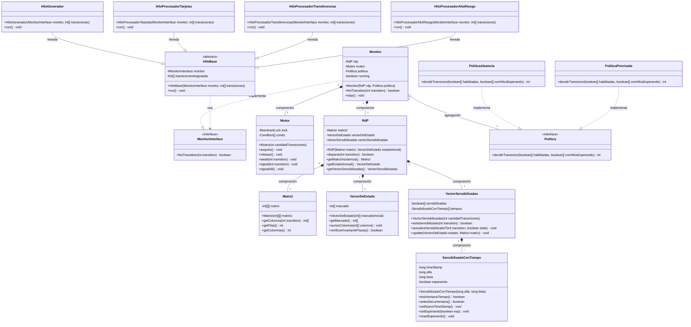

# Diagrama de Clases - TP Final Programación Concurrente 2026

Este archivo contiene el diagrama de clases que modela el sistema de procesamiento de pagos (PSP) basado en la Red de Petri descripta en el enunciado y la secuencia de llamadas definida en [DiagramdeSecuencia.md](file:///d:/facultad/concurrente/TPFinalConcurrente/DiagramdeSecuencia.md).

## Diagrama en Mermaid

## Relación con el Diagrama de Secuencia

El diagrama de secuencia describe el flujo detallado dentro de un intento de disparo (`fireTransition`):
1. **Hilo de Ejecución** (por ejemplo, `HiloProcesadorTarjetas`) llama a `monitor.fireTransition(t)`.
2. El `Monitor` bloquea el acceso mediante `mutex.acquire()`.
3. Llama a `rdp.disparar(t)` para evaluar la red:
   - `rdp` consulta a `vectorSensibilizadas.estaSensibilizado(t)`.
   - `vectorSensibilizadas` consulta a la instancia correspondiente de `SensibilizadoConTiempo` mediante `testVentanaTiempo()`.
   - Si está dentro de la ventana de tiempo (`ventana == true`), se procede a actualizar el marcado.
   - Si no está habilitado o está antes de la ventana, el hilo libera el lock (`mutex.release()`), marca el estado como esperando (`setEsperando(true)`), y duerme (`sleep`).
4. Si la transición se dispara exitosamente (`k == true`):
   - El estado cambia sumando la columna de la matriz de incidencia (`estado = estado + columna`).
   - Se actualizan los índices de sensibilización de las transiciones afectadas llamando a `actualiceSensibilizadoT(t, state)` y se actualiza el `timeStamp` para las transiciones recién sensibilizadas.
5. El monitor consulta a `Politica` para ver a qué transición habilitada y con hilos en espera debe despertar, y envía la señal a través del `Mutex` (`mutex.signal(t_seleccionada)`).
6. El `Monitor` libera el lock con `mutex.release()`.
