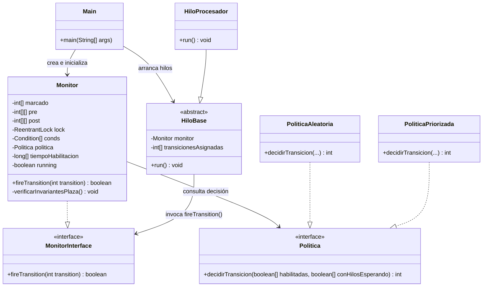

# Análisis y Desglose del Trabajo Práctico Final: Sistema de Procesamiento de Transacciones de Pago (PSP)

Este documento presenta una guía completa para comprender el Trabajo Práctico Final de Programación Concurrente 2026. Desglosa los conceptos teóricos, define las preguntas de diseño que tu grupo debe resolver, propone una arquitectura de software limpia en Java y delinea una hoja de ruta paso a paso para encarar el desarrollo.

---

## 1. Entendiendo el Enunciado (El Dominio del Problema)

El proyecto consiste en simular un sistema de procesamiento de pagos concurrentes modeledo mediante una **Red de Petri**. Este sistema simula el funcionamiento de un PSP (Payment Service Provider), similar a la infraestructura de procesamiento de pagos de empresas como Stripe, MercadoPago, etc.

### Componentes Clave del Sistema:

1. **Arribo de Transacciones (`P0`)**:
   - Es el punto de entrada de la red (cola IDLE). Representa las transacciones que llegan al sistema y están esperando ser admitidas.
   
2. **Admisión (`P1`)**:
   - Cuando una transacción es admitida (se verifica su formato, esquema y autenticación del cliente), pasa a `P1`. Aquí está lista para ser ruteada hacia uno de los tres flujos de procesamiento.

3. **Flujos de Procesamiento**:
   - **Flujo de pago con tarjeta de crédito/débito (`P2` $\rightarrow$ `P3`)**: 
     - Tiene dos etapas secuenciales (ej. solicitar autorización al emisor de la tarjeta y capturar los fondos).
     - Requiere el **uso exclusivo** de una sesión con el Gateway de Red de Tarjetas (`P7`) durante todo su ciclo.
   - **Flujo de pago de alto riesgo (`P4`)**: 
     - Tiene una sola etapa (ej. scoring antifraude en tiempo real).
     - Requiere de manera **simultánea** ambos recursos compartidos: la sesión con el Gateway (`P7`) y un slot del motor antifraude (`P8`).
   - **Flujo de transferencia bancaria (`P5` $\rightarrow$ `P6`)**: 
     - Tiene dos etapas secuenciales (ej. validar la cuenta de destino y ejecutar la transferencia).
     - Requiere el **uso exclusivo** del motor antifraude (`P8`) durante todo su ciclo (debido a la irreversibilidad de las transferencias).

4. **Recursos Compartidos**:
   - **Gateway de Red de Tarjetas (`P7`)**: Representado por una cantidad finita de tokens. Determina cuántas sesiones concurrentes pueden establecerse con el procesador de tarjetas.
   - **Motor Antifraude (`P8`)**: Representado por una cantidad finita de tokens. Determina cuántos slots concurrentes de análisis de riesgo hay disponibles en el motor.

5. **Buffer de Salida (`P9`)**:
   - Es el destino final. Contiene las transacciones completamente procesadas y listas para su confirmación al cliente y posterior liquidación.

---

## 2. Preguntas Críticas de Diseño que Deben Hacerse

Para plantear correctamente el trabajo, tu grupo debe debatir y resolver los siguientes interrogantes:

### Pregunta 1: ¿Cómo lograr que el Monitor de Concurrencia sea 100% agnóstico a la Red de Petri?
> [!IMPORTANT]
> El enunciado exige de forma estricta que la clase `Monitor` no contenga referencias a transiciones puntuales del problema. Esto significa que **no puedes** programar lógica específica como `if (transicion == 3)` o variables como `tokensDeGateway`.

* **¿Cómo plantearlo?**
  - El monitor debe operar puramente mediante álgebra matricial y vectores. 
  - Debes definir el estado y las reglas de la red usando estructuras de datos genéricas:
    - `int[] marcadoActual`: El número de tokens en cada plaza.
    - `int[][] matrizPre` y `int[][] matrizPost`: Las condiciones necesarias para disparar y cómo cambian los tokens tras el disparo (o una única `matrizIncidencia`).
  - El método `fireTransition(int t)` debe:
    1. Chequear si la columna `t` de la matriz de pre-condiciones es menor o igual al marcado actual (verificar si la transición está habilitada por marcado).
    2. Modificar el marcado restando los tokens consumidos y sumando los generados: $M_{nuevo} = M_{actual} - Pre(\cdot, t) + Post(\cdot, t)$.
  - Las matrices y el marcado inicial deben inyectarse al monitor a través de su constructor o cargarse de un archivo de configuración (JSON, CSV, etc.).

### Pregunta 2: ¿Cómo diseñar el mecanismo de exclusión mutua y sincronización dentro del Monitor?
* **¿Cómo plantearlo?**
  - Utiliza `java.util.concurrent.locks.ReentrantLock` para garantizar que solo un hilo a la vez acceda y modifique el marcado de la red.
  - Define un arreglo de variables de condición (`Condition[] conds`), donde tendrás una condición asociada a cada transición de la red.
  - Si un hilo invoca `fireTransition(t)` y la transición `t` **no está habilitada**:
    - El hilo se bloquea llamando a `conds[t].await()`.
  - Cuando una transición se dispara con éxito:
    - El marcado cambia. Esto podría habilitar transiciones que antes estaban bloqueadas.
    - El monitor debe verificar cuáles transiciones están habilitadas ahora y tienen hilos esperando en sus respectivas variables de condición.
    - En lugar de despertar a todos (`signalAll` generalizado), se utiliza el objeto **Política** para decidir de forma inteligente a cuál de las transiciones habilitadas se le dará prioridad para ejecutarse. Luego se despierta a un hilo de esa transición específica usando `conds[t_seleccionada].signal()`.

### Pregunta 3: ¿Cómo implementar el Tiempo sin bloquear todo el sistema (Timeouts)?
> [!WARNING]
> Si una transición temporal (`T2`, `T3`, etc.) está habilitada pero su tiempo de espera no ha transcurrido, y el hilo que la dispara hace un `Thread.sleep()` **adquiriendo el lock del monitor**, el programa entero se congelará. **Ningún otro hilo podrá entrar al monitor.**

* **¿Cómo plantearlo?**
  - **Identificar cuándo se habilita una transición:** Cuando una transición temporal pasa de estar deshabilitada a habilitada, el monitor debe registrar la marca de tiempo actual (`System.currentTimeMillis()`).
  - **Manejar la llamada a `fireTransition(t)`:**
    - Al ingresar al monitor, el hilo evalúa si la transición temporal está habilitada.
    - Calcula el tiempo restante: `tiempo_restante = (tiempo_de_habilitación + delay) - System.currentTimeMillis()`.
    - Si `tiempo_restante <= 0`, la transición puede dispararse inmediatamente.
    - Si `tiempo_restante > 0`, el hilo **debe liberar el lock del monitor** y esperar ese tiempo antes de intentar de nuevo. Esto se logra mediante esperas con timeout sobre la variable de condición: `conds[t].awaitNanos(...)` o liberando temporalmente el lock y durmiendo afuera del monitor.

### Pregunta 4: ¿Cómo mapear y distribuir las responsabilidades de los Hilos?
* **¿Cómo plantearlo?**
  - Los hilos no disparan transiciones al azar de forma caótica; se estructuran en base a los **Invariantes de Transición**.
  - Un invariante de transición representa una secuencia de transiciones cuya ejecución completa deja el marcado de la red idéntico al inicial (es decir, una transacción que ingresa, se procesa por un flujo y sale).
  - La guía te da dos reglas claras:
    - **Caso 1 (Conflicto de ruteo):** Dado que las transacciones en `P1` pueden ir a cualquiera de los tres flujos, hay un conflicto. El enunciado indica que debe haber un hilo encargado de las transiciones previas al conflicto (admisión), y luego hilos individuales dedicados a ejecutar cada flujo específico (cada invariante).
    - **Caso 2 (Join):** Si un invariante tiene un join con otro, después del join debe haber tantos hilos como tokens simultáneos permita la plaza.
  - Tu tarea será identificar estos caminos en la red y crear las clases de hilos correspondientes (ej. `HiloGenerador`, `HiloProcesadorTarjetas`, `HiloProcesadorTransferencias`, etc.), asignándoles bucles donde invoquen `fireTransition` para las transiciones bajo su responsabilidad.

### Pregunta 5: ¿Cómo garantizar una finalización limpia de los hilos?
* **¿Cómo plantearlo?**
  - Cuando se completen 200 transacciones exitosas (invariantes completados en `P9`), el monitor debe activar una bandera booleana global (ej. `running = false`).
  - Inmediatamente después, el monitor debe hacer un broadcast/despertar a todas las variables de condición (`signalAll()`) para que todos los hilos que estén dormidos despierten.
  - Los hilos, al despertar o al iniciar su bucle de ejecución, deben evaluar la bandera `running`. Si es `false`, deben finalizar su método `run()` limpiamente.
  - En la clase `Main`, debes hacer un `join()` sobre todos los hilos creados para asegurar que el hilo principal espera a que terminen por completo antes de cerrar el programa.

---

## 3. Arquitectura del Código Propuesta

Para resolver esto con buenas prácticas de Orientación a Objetos, se sugiere estructurar el sistema con el siguiente esquema de clases:

### Descripción de las clases sugeridas:

* **`Main`**: Es el orquestador. Define los datos de la red de Petri (marcado inicial, matrices `Pre` y `Post` obtenidas de PIPE), crea el `Monitor` inyectándole la `Politica` seleccionada, arranca los hilos y espera a su finalización para emitir los reportes.
* **`Monitor`**: Encapsula el estado de la Red de Petri y las reglas de disparo. Controla el acceso concurrente mediante un `ReentrantLock` y gestiona las esperas de los hilos.
* **`Politica` (Interface)**: Define la estrategia para resolver conflictos de disparo. Al tener esta interfaz, puedes intercambiar fácilmente la política aleatoria por la priorizada sin modificar el código interno del `Monitor`.
* **`HiloBase` / `HiloProcesador`**: Representan a los trabajadores concurrentes. Cada hilo tiene un subconjunto de transiciones que intentará disparar en bucle continuo hasta que el monitor indique el fin de la simulación.
* **`VerificadorInvariantes` (Auxiliar)**: Una utilidad que lee el archivo de log (donde escribes la secuencia de transiciones disparadas) y valida mediante **Expresiones Regulares** que la secuencia histórica de disparos se compone exactamente de combinaciones válidas de los invariantes de transición de la red.

---

## 4. Hoja de Ruta Paso a Paso para Desarrollar el Proyecto

Para evitar perderse en la complejidad de la concurrencia, es sumamente recomendable seguir este plan ordenado:

### Fase 1: Análisis Teórico y PIPE (El diseño de la Red)
1. **Modelar en PIPE:** Dibuja la red basándote en la imagen `RedPetri.png`.
2. **Análisis de Propiedades:** Corre los análisis automáticos de PIPE para extraer:
   - Invariantes de Plaza (P-Invariants) $\rightarrow$ Ecuaciones de conservación de tokens.
   - Invariantes de Transición (T-Invariants) $\rightarrow$ Secuencias cíclicas de disparo.
   - Presencia de deadlocks o trampas.
3. **Extraer Matrices:** Obtén las matrices de incidencia (Pre y Post) y el marcado inicial de la red desde PIPE.

### Fase 2: El Monitor Base (Sin tiempo, sin políticas complejas)
1. **Estructura Matricial:** Implementa el monitor en Java que valide si una transición está habilitada comparando vectores y que realice la actualización matemática del marcado.
2. **Sincronización:** Añade el lock y el array de condiciones. Implementa la lógica de que un hilo se duerma si la transición no está habilitada.
3. **Disparo Genérico:** Al dispararse una transición, evalúa cuáles quedaron habilitadas y despierta a los hilos correspondientes. En esta fase inicial, si hay múltiples habilitadas, simplemente despierta una de forma básica (o despierta a todas con `signalAll` momentáneamente para verificar la lógica de transición, aunque luego deberás refinarlo).

### Fase 3: Asignación e Implementación de Hilos
1. **Clasificación de Hilos:** Define la cantidad de hilos según la sección del enunciado ("cantidad de hilos necesarios") y la referencia del artículo.
2. **Escribir los Runnables:** Programa los hilos para que ejecuten su ciclo de disparos.
3. **Verificación Inicial:** Corre el programa con los hilos. Deberías ver transacciones fluyendo desde la entrada `P0` hasta la salida `P9` sin colgarse (deadlock) y finalizando limpiamente tras procesar 200 elementos.

### Fase 4: Incorporación del Tiempo (Temporización)
1. **Control de Habilitación:** Agrega en el monitor un registro (`long[]`) para guardar el momento exacto (`System.currentTimeMillis()`) en el que cada transición se habilita.
2. **Control de Disparo Temporal:** Modifica la lógica para que las transiciones temporizadas (`T2, T3, T5, T7, T8`) verifiquen si ha transcurrido el tiempo mínimo requerido.
3. **Espera no bloqueante:** Asegura que los hilos esperen la diferencia de tiempo requerida liberando el lock del monitor.
4. **Sintonización:** Ajusta los tiempos elegidos para las transiciones de modo que procesar 200 transacciones tome entre 20 y 40 segundos.

### Fase 5: Implementación de Políticas
1. **Política Aleatoria:** Implementa la interfaz `Politica` para resolver conflictos de forma aleatoria cuando múltiples transiciones estén habilitadas.
2. **Política Priorizada:** Implementa la priorización del flujo de alto riesgo (priorizando los disparos de transiciones del flujo que utiliza `P7` y `P8` en simultáneo).
3. **Pruebas comparativas:** Realiza múltiples ejecuciones de 200 transacciones con cada política y guarda los logs.

### Fase 6: Verificación y Reportes
1. **Invariantes de Plaza (Dinámicos):** En el monitor, luego de cada disparo, verifica que se cumplan las ecuaciones de los invariantes de plaza (la suma de tokens en plazas críticas y recursos debe dar constante). Si falla, lanza un error inmediatamente.
2. **Invariantes de Transición (Post-procesamiento):** Graba todos los disparos a un archivo de texto. Diseña expresiones regulares para agrupar y validar que las transacciones procesadas se ajusten a los invariantes de transición calculados en la Fase 1.
3. **Diagramas:** Dibuja el diagrama de clases y el diagrama de secuencia detallando la interacción de un disparo con el monitor y la política.

---

## 5. Glosario de Conceptos que debes dominar para la Defensa

* **Monitor de Concurrencia:** Estructura que encapsula variables compartidas y proporciona exclusión mutua para su acceso, además de variables de condición para suspender y reanudar la ejecución de hilos según el estado de los datos.
* **Invariantes de Plaza (P-Invariants):** Conjuntos de plazas donde la suma ponderada de tokens permanece constante para cualquier secuencia de disparo válida. Representan recursos limitados u objetos en conservación.
* **Invariantes de Transición (T-Invariants):** Secuencias de disparos que regresan la red a su estado inicial. Representan ciclos de procesamiento completos en el sistema.
* **Conflicto (en Redes de Petri):** Ocurre cuando dos o más transiciones compiten por el mismo token de una plaza, y el disparo de una de ellas deshabilita a la otra.
* **Join / Sincronización:** Ocurre cuando una transición requiere tokens de múltiples plazas de entrada para dispararse (ej. el flujo de alto riesgo que requiere tokens de `P7` y `P8` simultáneamente).
