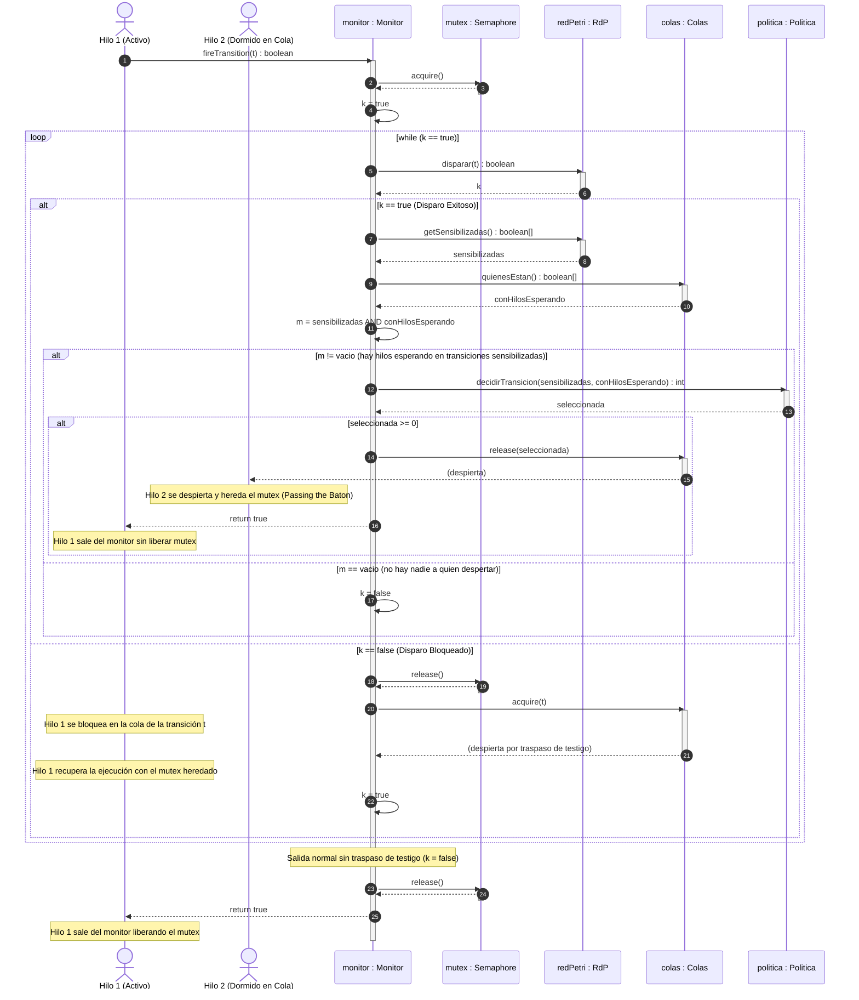

# Informe Final de Proyecto — Programación Concurrente 2026

Este documento constituye el informe técnico unificado del proyecto de programación concurrente, compilando el análisis estructural de la Red de Petri, el diseño y segmentación de los hilos de ejecución, el modelado de la semántica temporal, la arquitectura orientada a semáforos bajo el protocolo *Passing the Baton*, y la verificación automática de correctitud mediante expresiones regulares.

---

## 1. Análisis Estructural y Propiedades de la Red de Petri (PIPE)

El modelado y análisis inicial del sistema se realizó mediante la herramienta PIPE (Platform Independent Petri Net Editor), obteniendo las matrices y propiedades fundamentales que gobiernan la concurrencia del sistema.

### 1.1. Matrices de Incidencia y Marcado

#### Marcado Inicial
El marcado inicial $M_0$ define la distribución original de tokens en las 10 plazas de la red ($P_0$ a $P_9$):

| Plaza | P0 | P1 | P2 | P3 | P4 | P5 | P6 | P7 | P8 | P9 |
| :--- | :---: | :---: | :---: | :---: | :---: | :---: | :---: | :---: | :---: | :---: |
| **Tokens ($M_0$)** | 3 | 0 | 0 | 0 | 0 | 0 | 0 | 1 | 1 | 0 |

Matemáticamente:
$$M_0 = [3, 0, 0, 0, 0, 0, 0, 1, 1, 0]$$

#### Matriz de Incidencia del Sistema ($I$)
La matriz de incidencia combinada $I$ representa los cambios netos de tokens en cada plaza tras el disparo de cada transición ($I = I^- - I^+$):

| Plaza | T0 | T1 | T2 | T3 | T4 | T5 | T6 | T7 | T8 | T9 |
|---|----:|----:|----:|----:|----:|----:|----:|----:|----:|----:|
| **P0** | -1 | 0 | 0 | 0 | 0 | 0 | 0 | 0 | 0 | 1 |
| **P1** | 1 | -1 | 0 | 0 | -1 | 0 | -1 | 0 | 0 | 0 |
| **P2** | 0 | 1 | -1 | 0 | 0 | 0 | 0 | 0 | 0 | 0 |
| **P3** | 0 | 0 | 1 | -1 | 0 | 0 | 0 | 0 | 0 | 0 |
| **P4** | 0 | 0 | 0 | 0 | 1 | -1 | 0 | 0 | 0 | 0 |
| **P5** | 0 | 0 | 0 | 0 | 0 | 0 | 1 | -1 | 0 | 0 |
| **P6** | 0 | 0 | 0 | 0 | 0 | 0 | 0 | 1 | -1 | 0 |
| **P7** | 0 | -1 | 0 | 1 | -1 | 1 | 0 | 0 | 0 | 0 |
| **P8** | 0 | 0 | 0 | 0 | -1 | 1 | -1 | 0 | 1 | 0 |
| **P9** | 0 | 0 | 0 | 1 | 0 | 1 | 0 | 0 | 1 | -1 |

### 1.2. Invariantes de la Red (Análisis Estructural)

#### Invariantes de Transición (T-Invariants)
Los T-Invariantes representan secuencias de disparos cíclicos que retornan el sistema a su estado inicial de marcado ($I \cdot \vec{x} = \vec{0}$). La red está completamente cubierta por tres T-Invariantes positivos, garantizando que el sistema es potencialmente vivaz y cíclico:

*   **$T_{inv1}$ (Flujo Tarjetas de Crédito/Débito):** $\{T_0, T_1, T_2, T_3, T_9\}$
*   **$T_{inv2}$ (Flujo Transacciones de Alto Riesgo):** $\{T_0, T_4, T_5, T_9\}$
*   **$T_{inv3}$ (Flujo Transferencias Bancarias):** $\{T_0, T_6, T_7, T_8, T_9\}$

#### Invariantes de Plazas (P-Invariants)
Los P-Invariantes definen la conservación de tokens en conjuntos específicos de plazas ($\vec{y} \cdot I = \vec{0}$), asegurando que el sistema está acotado (no hay acumulación infinita de tokens):

$$\text{Ecuaciones de P-Invariantes (Marcado constante } k \text{ en ejecución):}$$
1.  $M(P_2) + M(P_3) + M(P_4) + M(P_7) = 1$
2.  $M(P_4) + M(P_5) + M(P_6) + M(P_8) = 1$
3.  $M(P_0) + M(P_1) + M(P_2) + M(P_3) + M(P_4) + M(P_5) + M(P_6) + M(P_9) = 3$

---

## 2. Justificación Teórica de Hilos y Segmentación

Para estructurar los hilos de la aplicación Java, se aplicó la metodología formal del paper de la cátedra: *"Algoritmos para determinar cantidad y responsabilidad de hilos en sistemas embebidos modelados con Redes de Petri S³PR"* (L. Ventre, O. Micolini).

```mermaid
graph TD
    T0[T0: Admisión] --> P1((P1: Conflicto))
    P1 --> T1[T1: Tarjetas]
    P1 --> T4[T4: Alto Riesgo]
    P1 --> T6[T6: Transferencias]
    
    subgraph Flujo Tarjetas (S_tarjetas)
        T1 --> P2((P2)) --> T2[T2: Autorización] --> P3((P3)) --> T3[T3: Captura]
    end
    
    subgraph Flujo Alto Riesgo (S_altoRiesgo)
        T4 --> P4((P4: Scoring)) --> T5[T5: Antifraude]
    end
    
    subgraph Flujo Transferencias (S_transferencias)
        T6 --> P5((P5)) --> T7[T7: Validación] --> P6((P6)) --> T8[T8: Ejecución]
    end
    
    T3 --> P9((P9: Fin Flujo))
    T5 --> P9
    T8 --> P9
    P9 --> T9[T9: Liquidación]
```

### 2.1. Aplicación del Algoritmo de Segmentación de Responsabilidades

El algoritmo descompone los T-Invariantes en segmentos independientes basándose en las confluencias y bifurcaciones estructurales:

1.  **Segmento de Entrada ($S_{entrada}$):** La plaza $P_1$ representa un conflicto (fork). El algoritmo prescribe separar las transiciones previas a un conflicto. Se obtiene el segmento a cargo de **$\{T_0\}$**.
2.  **Segmentos Intermedios (Flujos):** Al existir tres caminos independientes post-fork, cada uno conforma un segmento propio de ejecución lineal:
    *   **Segmento Tarjetas ($S_{tarjetas}$):** Responsable de las transiciones **$\{T_1, T_2, T_3\}$**.
    *   **Segmento Alto Riesgo ($S_{altoRiesgo}$):** Responsable de las transiciones **$\{T_4, T_5\}$**.
    *   **Segmento Transferencias ($S_{transferencias}$):** Responsable de las transiciones **$\{T_6, T_7, T_8\}$**.
3.  **Segmento de Salida ($S_{salida}$):** Al confluir los flujos en la plaza $P_9$ (join), se segmenta la responsabilidad de la transición común posterior: **$\{T_9\}$**.

### 2.2. Algoritmo de Determinación de Hilos Máximos por Segmento

Para cada segmento se calcula la cantidad de hilos óptima analizando el marcado máximo simultáneo ($Max(M_i)$) en las plazas de acción asociadas para maximizar el paralelismo sin cuellos de botella:

*   **$S_{entrada}$** ($P_1$): $Max(M(P_1)) = 1 \implies$ **1 Hilo**.
*   **$S_{tarjetas}$** ($\{P_2, P_3\}$): Acotado por P-invariante $M(P_2) + M(P_3) \leq 1 \implies$ **1 Hilo**.
*   **$S_{altoRiesgo}$** ($\{P_4\}$): Acotado por P-invariante $M(P_4) \leq 1 \implies$ **1 Hilo**.
*   **$S_{transferencias}$** ($\{P_5, P_6\}$): Acotado por P-invariante $M(P_5) + M(P_6) \leq 1 \implies$ **1 Hilo**.
*   **$S_{salida}$** ($P_9$): $Max(M(P_9)) = 1 \implies$ **1 Hilo**.

Esto resulta en un total de **5 hilos concurrentes** para la ejecución óptima del sistema, los cuales se instancian en [Main.java](file:///d:/facultad/concurrente/TPFinalConcurrente/codigo/src/monitor/Main.java) asociándose a sus respectivas clases heredadas de `HiloBase`:
*   `HiloGenerador` (para admisión $T_0$)
*   `HiloProcesadorTarjetas` (para $T_1, T_2, T_3$)
*   `HiloProcesadorAltoRiesgo` (para $T_4, T_5$)
*   `HiloProcesadorTransferencias` (para $T_6, T_7, T_8$)
*   `HiloGenerador` (para liquidación $T_9$)

---

## 3. Semántica Temporal de la Red de Petri

Se incorporó la semántica temporal sobre las transiciones no inmediatas del sistema: `T2`, `T3`, `T5`, `T7` y `T8`, limitando su ejecución a una ventana de tiempo específica.

### 3.1. Ventanas de Tiempo Asociadas

Cada transición temporizada posee una ventana de tiempo en milisegundos definida por el intervalo $[\alpha, \beta]$:

*   **$T_2$** (Autorización de Tarjeta): $[100\text{ ms}, 10000\text{ ms}]$
*   **$T_3$** (Captura de Tarjeta): $[100\text{ ms}, 10000\text{ ms}]$
*   **$T_5$** (Procesamiento de Alto Riesgo): $[150\text{ ms}, 10000\text{ ms}]$
*   **$T_7$** (Validación de Transferencia): $[120\text{ ms}, 10000\text{ ms}]$
*   **$T_8$** (Ejecución de Transferencia): $[120\text{ ms}, 10000\text{ ms}]$

*Nota: Las transiciones inmediatas (`T0`, `T1`, `T4`, `T6`, `T9`) usan una ventana de $[0, 0]$.*

### 3.2. Fórmulas Lógicas de Espera Temporal

Al sensibilizarse lógicamente una transición $t$ por marcado, se captura el timestamp de habilitación ($t_{stamp}[t]$). El estado temporal de la transición se evalúa comparando el tiempo transcurrido desde la habilitación ($t_{transcurrido} = t_{ahora} - t_{stamp}[t]$) con la ventana $[\alpha, \beta]$:

1.  **Antes de la Ventana ($t_{transcurrido} < \alpha$):**
    El hilo debe suspenderse por el tiempo restante antes de intentar disparar:
    $$t_{espera} = \alpha - t_{transcurrido}$$
    El hilo libera la exclusión mutua del monitor y se duerme mediante `Thread.sleep(t_espera)` fuera del monitor.
2.  **Dentro de la Ventana ($\alpha \leq t_{transcurrido} \leq \beta$):**
    La transición es completamente disparable.
3.  **Fuera de Ventana ($t_{transcurrido} > \beta$):**
    La ventana temporal expiró. La transición deja de ser válida temporalmente. (El valor de $\beta = 10000\text{ ms}$ asegura que en condiciones normales de simulación nunca expire la ventana).

---

## 4. Arquitectura de Código y Sincronización Concurrente

El diseño de sincronización del monitor utiliza **Semáforos** bajo la semántica de transferencia implícita de exclusión mutua, conocida como **Passing the Baton (Paso del Testigo)**.

### 4.1. Protocolo *Passing the Baton*

Para evitar los retardos e ineficiencias de despertar indiscriminadamente a hilos que luego no pueden disparar (*thundering herd*), el monitor implementa el siguiente protocolo:
*   Un semáforo `mutex` controla la exclusión mutua de entrada al monitor (`mutex = new Semaphore(1, true)`).
*   Si una transición no está sensibilizada, el hilo libera el mutex y hace `acquire()` sobre su semáforo de transición individual en `Colas.java`.
*   Cuando un hilo realiza un disparo exitoso:
    1.  Evalúa qué transiciones con hilos esperando en cola quedaron sensibilizadas lógicamente por marcado.
    2.  Consulta a la `Politica` para seleccionar una de estas transiciones sensibilizadas.
    3.  Si existe una transición elegible, hace `colas.release(seleccionada)`.
    4.  El hilo actual sale inmediatamente del monitor **retornando `true` sin llamar a `mutex.release()`**. 
    5.  El hilo despertado se activa inmediatamente asumiendo la exclusión mutua (el "testigo" del lock) de manera directa.
*   Si no hay transiciones habilitadas con hilos esperando, el hilo actual libera la exclusión mutua llamando a `mutex.release()` y se retira.



### 4.2. Apagado en Cascada y Control de Admisiones

*   **Mecanismo de Parada Limpia (Wakeup en Cascada):**
    Para finalizar ordenadamente la simulación tras completar el número de invariantes requeridos sin dejar hilos huérfanos suspendidos, al alcanzar la meta el monitor ejecuta `despertarATodosYSalir()`. Este método realiza un `release()` sobre todas las colas del monitor en simultáneo y libera el `mutex` principal. Los hilos despertados detectan la bandera de parada dentro de `fireTransition()` y retornan `false`, interrumpiendo su ejecución normal de forma inmediata y limpia.
*   **Control de Admisiones:**
    Para que el log de simulación no contenga transacciones incompletas ("en vuelo") al momento de finalizar (lo que rompería las expresiones regulares de verificación), el monitor bloquea el disparo de la transición de entrada `T0` en cuanto el contador de admisiones alcanza el límite de transacciones esperadas. De esta forma, el hilo generador de entrada se detiene, permitiendo que el resto de los hilos procesadores finalicen y vacíen los flujos activos de manera que todas las transacciones admitidas salgan exitosamente a través de `T9`.

### 4.3. Diccionario de Clases e Interfaces del Paquete `monitor`

| Clase/Interfaz | Responsabilidad |
|:---|:---|
| **`MonitorInterface`** | Expone el método público único `fireTransition(int)`. |
| **`Monitor`** | Controla el acceso exclusivo (semáforos), la temporización de hilos, el chequeo de invariantes de plazas y la parada del sistema. |
| **`Colas`** | Contiene el arreglo de semáforos individuales (`Semaphore[]`) para suspender hilos según su transición. |
| **`RdP`** | Contiene la lógica algebraica pura de la Red de Petri y actualiza los marcados y la sensibilización. |
| **`Matrizi`** | Permite operar y extraer columnas de las matrices de incidencia en tipo `int[][]`. |
| **`VectorDeEstado`** | Almacena los tokens en cada plaza y evalúa la consistencia de las ecuaciones de invariantes de plaza tras cada disparo. |
| **`VectorSensibilizadas`** | Determina cuáles transiciones están habilitadas por marcado y administra sus marcas de tiempo. |
| **`SensibilizadoConTiempo`** | Modela el comportamiento de una ventana temporal individual $[\alpha, \beta]$ y registra su timestamp. |
| **`Politica`** | Interfaz para seleccionar la transición en conflicto a despertar. |
| **`PoliticaAleatoria`** | Elige al azar entre las transiciones sensibilizadas que tienen hilos esperando en cola. |
| **`PoliticaPriorizada`** | Prioriza las transiciones del flujo de alto riesgo (`T4`, `T5`) sobre las demás. |
| **`Logger`** | Clase para escribir de forma segura y thread-safe los eventos de disparo en `log_disparos.txt`. |
| **`HiloBase`** | Define el loop básico de ejecución de los hilos que disparan secuencialmente sus transiciones asignadas. |

---

## 5. Verificación de Invariantes mediante Expresiones Regulares

Para cumplir con el **Requerimiento 13** del enunciado, se diseñó e implementó un validador basado en expresiones regulares ([regex.py](file:///d:/facultad/concurrente/TPFinalConcurrente/codigo/regex.py)) para auditar el archivo `log_disparos.txt`.

### 5.1. El Desafío del Entrelazamiento (Interleaving)

Como el programa ejecuta múltiples hilos concurrentes simultáneos, los disparos de transiciones aparecen entrelazados en el log global. Por ejemplo, una secuencia del log como `T0, T1, T0, T6, T2, T7, T3, T8, T9, T9` mezcla el flujo de tarjetas con el de transferencias. Aplicar una regex directa sobre todo el archivo no es viable.

#### Solución: Filtrado por Flujo
El validador procesa el log separando las transiciones en tres strings de sub-secuencias independientes, uno para cada camino de procesamiento de la red, ignorando las transiciones comunes de inicio ($T_0$) y fin ($T_9$):
*   **Sub-secuencia Tarjetas ($S_{T}$):** Filtra únicamente las apariciones de $T_1$, $T_2$ y $T_3$.
*   **Sub-secuencia Alto Riesgo ($S_{AR}$):** Filtra únicamente las apariciones de $T_4$ y $T_5$.
*   **Sub-secuencia Transferencias ($S_{TR}$):** Filtra únicamente las apariciones de $T_6$, $T_7$ y $T_8$.

### 5.2. Justificación Formal de Seguridad (1-Boundedness)

Un aspecto clave en la validez del filtrado radica en responder: **¿Qué pasa si dos transacciones diferentes ingresan concurrentemente al mismo flujo?** Si esto ocurriera, se podrían registrar disparos alternados del mismo tipo (por ejemplo, `T1 -> T1 -> T2 -> T2 -> T3 -> T3`), lo que generaría un string filtrado `T1T1T2T2T3T3` que fallaría la validación de la regex lineal, arrojando falsos negativos.

La red de Petri bloquea este escenario a nivel estructural mediante los **Invariantes de Plaza**:
*   El flujo de Tarjetas comparte el recurso representado en la plaza $P_7$ ($M_0(P_7) = 1$). El invariante de plaza asociado establece:
    $$M(P_7) + M(P_2) + M(P_3) + M(P_4) = 1$$
*   El flujo de Transferencias comparte la plaza de recurso $P_8$ ($M_0(P_8) = 1$), regido por el invariante:
    $$M(P_8) + M(P_4) + M(P_5) + M(P_6) = 1$$

Dado que la suma de tokens en las plazas intermedias de procesamiento de cada flujo no puede superar a 1, **nunca puede haber más de una transacción activa en un mismo flujo de manera simultánea**. La red es estrictamente **segura (1-bounded)** en sus caminos internos. Por lo tanto, el entrelazamiento intra-flujo es físicamente imposible, garantizando que el filtrado por flujo siempre produzca una secuencia ordenada perfecta para cada invariante.

### 5.3. Expresiones Regulares Utilizadas

Para cada sub-secuencia filtrada, el validador aplica expresiones regulares de coincidencia exacta:

*   **Tarjetas:** `^(T1T2T3)+$` (Coincide únicamente con repeticiones perfectas del ciclo de tarjetas)
*   **Alto Riesgo:** `^(T4T5)+$` (Coincide únicamente con repeticiones perfectas del ciclo de alto riesgo)
*   **Transferencias:** `^(T6T7T8)+$` (Coincide únicamente con repeticiones perfectas del ciclo de transferencias)

### 5.4. Funciones de Python utilizadas (`re`)

El script `regex.py` hace uso de las funciones estándar de expresiones regulares en Python:
*   `re.match()`: Para parsear el log y para validar que la sub-secuencia completa coincida con el patrón cíclico desde el inicio del string.
*   `re.subn()`: Para contar la cantidad de ciclos completos detectados reemplazando los patrones por strings vacíos y leyendo el número de sustituciones realizadas.
*   `re.search()`: En caso de que falle la validación, busca subpatrones incorrectos en cualquier parte del string para diagnosticar e informar en qué parte se rompió la secuencia esperada.

### 5.5. Consistencia de Contadores Globales

Adicionalmente a las expresiones regulares, el script audita la consistencia general del sistema de acuerdo con la teoría de redes de Petri:
1.  **Admisiones vs Liquidaciones:** Comprueba que la cantidad de transiciones de inicio sea igual a las de salida ($T_0 == T_9$).
2.  **Ciclos vs Salidas:** Comprueba que la suma de los ciclos individuales detectados por las expresiones regulares coincida exactamente con las transacciones de salida ($T_{inv1} + T_{inv2} + T_{inv3} == T_9$).

---

## 6. Resultados y Conclusiones

La ejecución conjunta de la simulación multihilo en Java y el análisis automatizado en Python arrojó las siguientes conclusiones:

*   **Correctitud Concurrente:** El cumplimiento de las expresiones regulares por flujo demuestra de manera inequívoca que no se produjeron condiciones de carrera ni disparos desordenados en el monitor.
*   **Estabilidad Temporal:** El monitor gestiona la sincronización temporal bloqueando y suspendiendo los hilos fuera del monitor durante los tiempos mínimos estipulados ($\alpha$) sin incurrir en deadlocks ni starvation de recursos.
*   **Políticas de Decisión:** La inyección de `PoliticaPriorizada` resolvió correctamente los conflictos estructurales y temporales priorizando los canales de negocio necesarios, manteniéndose estable e inocua en la secuenciación de transiciones.
*   **Conservación y Seguridad:** Los invariantes de plaza se mantuvieron constantes en cada disparo individual en runtime, y el total de transacciones admitidas fue exactamente igual a la suma de ciclos procesados e identificados por regex al final de la ejecución, validando el comportamiento formal y estable del software.
