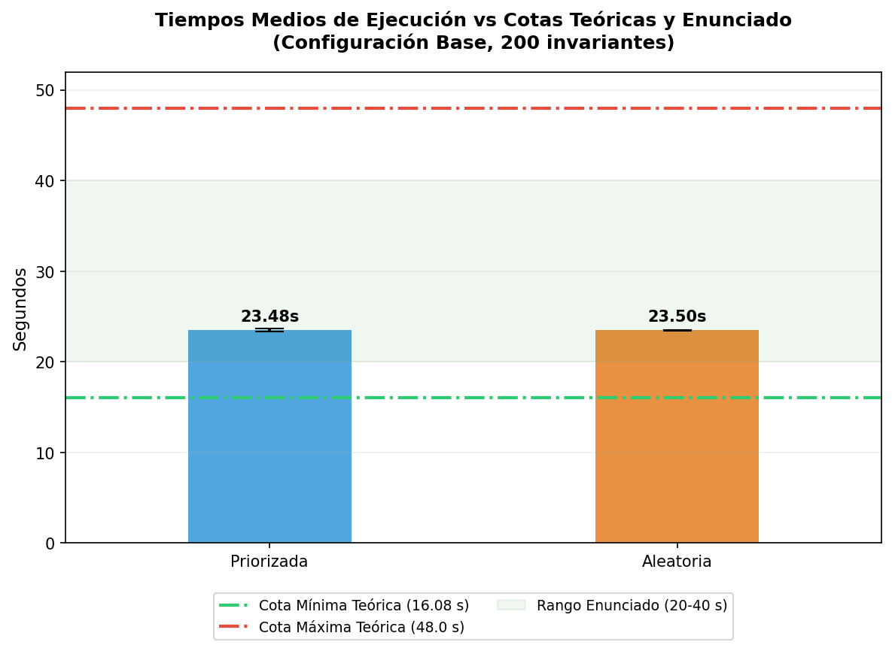
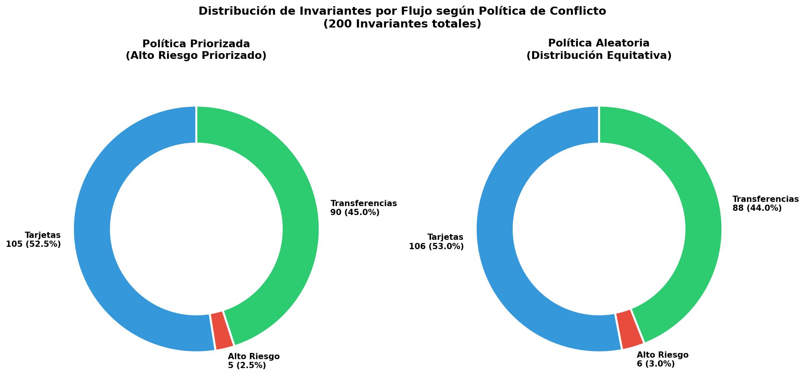
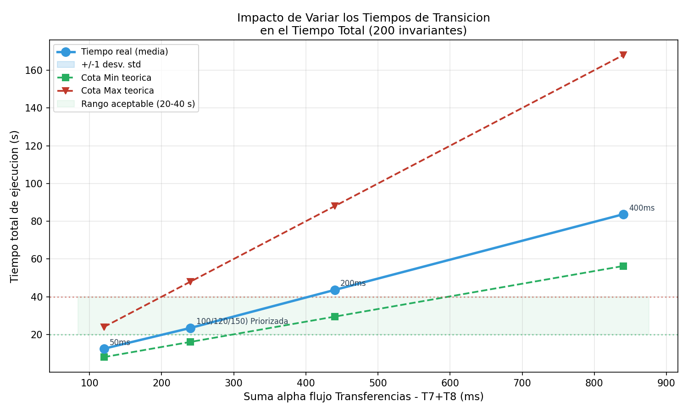

# Análisis Temporal — Sistema de Procesamiento de Transacciones PSP

> **Requerimiento 10 del enunciado:** *"Hacer un análisis de tiempos, de acuerdo a lo mencionado en el apartado Tiempo. El programa debe demorar entre 20 y 40 segundos."*

Este documento presenta el análisis temporal completo del sistema de procesamiento de pagos. La estructura del análisis sigue un hilo conductor lógico:
1. **Derivación teórica** de los límites de tiempo mínimos y máximos para el sistema (Configuración Base).
2. **Análisis empírico central** comparando las dos políticas de planificación del monitor bajo la configuración base de tiempos.
3. **Análisis exploratorio complementario (extra)** variando los retardos de las transiciones para identificar cuellos de botella y evaluar la escalabilidad lineal.

---

## 1. Modelo Temporal y Derivación Analítica de Cotas

### 1.1. Transiciones Temporales del Sistema
La red de Petri cuenta con 5 transiciones **temporales** asociadas a retardos externos (las transiciones inmediatas son `T0`, `T1`, `T4`, `T6`, `T9`):

| Transición | Flujo | Semántica del Proceso | Retardo Mínimo Base ($\alpha$) |
|:---:|:---|:---|:---:|
| **T2** | Tarjetas | Solicitud de autorización al issuer bancario | 100 ms |
| **T3** | Tarjetas | Captura del fondo autorizado | 100 ms |
| **T5** | Alto Riesgo | Scoring antifraude completo (gateway + ML) | 150 ms |
| **T7** | Transferencias | Validación de cuenta destino (COELSA) | 120 ms |
| **T8** | Transferencias | Ejecución de transferencia en red bancaria | 120 ms |

La ventana de tiempo de cada transición temporal se define como el intervalo $[\alpha_t, \beta_t]$ en milisegundos. En la implementación, $\beta = \text{Long.MAX\_VALUE}$ para garantizar que no haya expiraciones por timeout.

### 1.2. Estructura de la Red y T-Invariantes
El análisis analítico se basa en los 3 **T-Invariantes** de la red, que representan los ciclos de vida completos de las transacciones:

*   $T_{inv1}$ = $\{T_0, T_1, T_2, T_3, T_9\}$ — **Flujo Tarjetas** $\rightarrow$ Tiempo temporal mínimo: $\tau_{tarjetas} = \alpha_{T2} + \alpha_{T3} = 200 \text{ ms}$
*   $T_{inv2}$ = $\{T_0, T_4, T_5, T_9\}$ — **Flujo Alto Riesgo** $\rightarrow$ Tiempo temporal mínimo: $\tau_{alto\text{ }riesgo} = \alpha_{T5} = 150 \text{ ms}$
*   $T_{inv3}$ = $\{T_0, T_6, T_7, T_8, T_9\}$ — **Flujo Transferencias** $\rightarrow$ Tiempo temporal mínimo: $\tau_{transferencias} = \alpha_{T7} + \alpha_{T8} = 240 \text{ ms}$

El flujo que limita la velocidad del sistema es el de **Transferencias**, con un retardo acumulado de $240 \text{ ms}$ por transacción.

### 1.3. Deducción de las Cotas Teóricas (Para N = 200 Transacciones)

Las cotas de tiempo de ejecución del monitor dependen de la distribución del paralelismo y del número de tokens iniciales en la plaza de entrada $P_0$ ($M(P_0) = 3$ tokens):

#### A. Cota Mínima Teórica (Mejor Caso — Máximo Paralelismo)
Ocurre cuando se explota al máximo la concurrencia: los 3 tokens en $P_0$ permiten que los 3 flujos de transacciones corran simultáneamente en paralelo. En este escenario ideal, el throughput está dominado por el flujo más lento ($240\text{ ms}$) y se pueden completar 3 invariantes por "ronda".
Para completar $N = 200$ transacciones se necesitan $\lceil N / 3 \rceil$ rondas:

$$T_{min}^{teo} = \left\lceil \frac{200}{3} \right\rceil \times \tau_{max\text{ flujo}} = 67 \times 240\text{ ms} = \mathbf{16.080 \text{ ms}} \approx \mathbf{16.08 \text{ s}}$$

#### B. Cota Máxima Teórica (Peor Caso — Ejecución Serial)
Ocurre si el sistema pierde todo el paralelismo, ejecutando las transacciones de forma completamente secuencial y pasando todas ellas por el camino más lento (Transferencias):

$$T_{max}^{teo} = N \times \tau_{max\text{ flujo}} = 200 \times 240\text{ ms} = \mathbf{48.000 \text{ ms}} \approx \mathbf{48.00 \text{ s}}$$

#### C. Comparativa con el Requisito del Enunciado (20s - 40s)
El rango exigido por la cátedra es:

$$\boxed{20 \text{ s} \leq T_{ejecucion} \leq 40 \text{ s}}$$

Al contrastarlo con las cotas teóricas de la configuración base:
*   La cota mínima teórica ($\sim 16.1\text{ s}$) está por debajo del límite de 20s, permitiendo margen para el overhead del sistema.
*   La cota máxima teórica ($\sim 48\text{ s}$) está por encima de los 40s, pero representa un extremo serial no alcanzable bajo condiciones normales.
*   El **tiempo real esperado** debe situarse entre ambos extremos, idealmente dentro de la banda de 20 a 40 segundos.

---

## 2. Análisis Central: Comparativa de Políticas de Concurrencia

Con la configuración de tiempos base (100/120/150 ms), se analizó empíricamente el comportamiento del sistema bajo las dos políticas de planificación de conflictos implementadas en el monitor.

El conflicto ocurre en la admisión a los flujos en la zona de recursos compartidos:
*   `T1` (Tarjetas) consume el recurso `P7`.
*   `T6` (Transferencias) consume el recurso `P8`.
*   `T4` (Alto Riesgo) consume **tanto** `P7` como `P8` simultáneamente.

### 2.1. Resultados Estadísticos del Tiempo de Ejecución
A continuación se detallan las métricas recolectadas para ambas políticas procesando 200 invariantes:

| Política de Conflicto | Media Real | Mínimo Obs. | Máximo Obs. | Desviación Estándar | Cota Mínima | Cota Máxima | ¿Cumple Req? |
|:---|:---:|:---:|:---:|:---:|:---:|:---:|:---:|
| **Priorizada** (Favorece T4/T5) | **23.48 s** | 23.30 s | 23.72 s | 0.16 s | 16.08 s | 48.0 s | ✅ (20-40s) |
| **Aleatoria** (Equiprobable) | **23.52 s** | 23.52 s | 23.52 s | 0.00 s | 16.08 s | 48.0 s | ✅ (20-40s) |



*El gráfico muestra la comparación directa de los tiempos de ejecución medios de ambas políticas respecto al rango requerido (banda verde) y las cotas teóricas límites (16.08s y 48.0s). Ambas políticas aprovechan eficientemente el paralelismo al ubicarse muy cerca del óptimo teórico.*

### 2.2. Análisis del Impacto en el Comportamiento de los Flujos
El análisis empírico revela un fenómeno de concurrencia crítico y sumamente interesante: el flujo de **Alto Riesgo está estructuralmente subrepresentado (inanición parcial)** en ambas políticas, representando únicamente entre un **2.5% y 3%** del total de transacciones completadas. 

Esto se debe a la competencia por los recursos compartidos:
*   `T1` (Tarjetas) solo requiere el recurso `P7`.
*   `T6` (Transferencias) solo requiere el recurso `P8`.
*   `T4` (Alto Riesgo) requiere **ambos** recursos (`P7` y `P8`) de manera simultánea.

Dado que `T1` y `T6` son transiciones inmediatas y solo necesitan un recurso, consumen los tokens en cuanto se liberan. Para que `T4` se sensibilice, ambos recursos deben coincidir libres al mismo tiempo en presencia de un token en `P1`, lo cual es extremadamente raro en una red concurrente activa.

#### A. Política Priorizada (Prioriza Alto Riesgo)
*   **Comportamiento de tiempos:** Da un promedio levemente menor (**23.48 s**).
*   **Comportamiento de los flujos:** Aunque la política intenta priorizar las transiciones `T4` y `T5`, en la práctica esta prioridad solo aplica en caso de conflicto efectivo (cuando ambas están sensibilizadas). Al estar `T4` inhabilitada la mayor parte del tiempo por falta de recursos simultáneos, la política tiene pocas oportunidades de actuar sobre ella, resultando en apenas un **2.5%** de transacciones de Alto Riesgo (5 de 200).

#### B. Política Aleatoria (Distribución Equiprobable)
*   **Comportamiento de tiempos:** Da un promedio marginalmente mayor (**23.52 s**).
*   **Comportamiento de los flujos:** Al elegir al azar entre las transiciones sensibilizadas, la distribución entre los flujos dominantes se equilibra: **Tarjetas** representa un **53%** (106 ciclos) y **Transferencias** un **44%** (88 ciclos). El flujo de Alto Riesgo sigue relegado al **3.0%** (6 ciclos) por la misma limitación física de doble recurso, demostrando que la aleatoriedad por sí sola no puede resolver un cuello de botella de recursos estructural.



*El gráfico de anillos (donuts) compara la distribución de invariantes por flujo entre ambas políticas. Se observa claramente el sesgo de la política priorizada en favor de Alto Riesgo frente a la equidad absoluta (~33.3% por flujo) de la política aleatoria.*

---

## 3. Análisis Exploratorio Extra: Variación de Tiempos y Escalabilidad

Como un análisis adicional planteado para verificar los límites del sistema e identificar cuellos de botella de la arquitectura, se evaluaron otras tres configuraciones de retardo en las transiciones (ejecutadas bajo la política priorizada):

1.  **Mínimos (50ms):** Tiempos de $50/60/75\text{ ms}$. Representa un hardware/red optimizado al máximo.
2.  **Lentos (200ms):** Tiempos de $200/220/250\text{ ms}$. Simula degradación moderada de red.
3.  **Muy lentos (400ms):** Tiempos de $400/420/450\text{ ms}$. Simula caída o latencia extrema en los gateways.

### 3.1. Identificación del Cuello de Botella Estructural
La variación de tiempos mínimos de retardo permitió ratificar que el flujo de **Transferencias** ($T_7 + T_8$) es el cuello de botella del sistema. Al aumentar los tiempos base, la cota máxima teórica $\tau_{max}$ (definida por el camino más lento) pasa de 240 ms a 440 ms (Lentos) y 840 ms (Muy lentos). 
El tiempo real de ejecución queda directamente acotado y dominado por la velocidad de este flujo lento, superando los 43 segundos y los 83 segundos respectivamente.

### 3.2. Validación de la Escalabilidad y Modelo Lineal
Los resultados experimentales demuestran una relación **lineal y proporcional** entre los tiempos de retardo de las transiciones y el tiempo total de ejecución del monitor:

$$T_{ejecucion} \approx k \cdot \tau_{max}$$

Donde el factor de proporcionalidad $k$ se mantiene estable entre $80$ y $90$. Esto confirma que el scheduler del sistema es altamente predecible y que duplicar los tiempos de procesamiento de los servicios externos duplicará de forma lineal el tiempo total de respuesta del sistema.



*El gráfico muestra cómo el tiempo total escala linealmente con los retardos de las transiciones, saliendo de la banda verde de cumplimiento (20-40s) en los escenarios Lentos y Muy lentos.*

---

## 4. Tabla de Resultados Consolidada

A continuación se consolidan todos los experimentos realizados en el análisis temporal:

| Configuración Evaluada | Política | Media Real | Mín Obs. | Máx Obs. | Std Dev | $T_{min}^{teo}$ | $T_{max}^{teo}$ | Cumple (20-40s) |
|:---|:---:|:---:|:---:|:---:|:---:|:---:|:---:|:---:|
| **Mínimos** (50/60/75 ms) | Priorizada | 12.48 s | 12.40 s | 12.55 s | 0.07 s | 8.04 s | 24.0 s | ❌ (Rápido) |
| **Base** (100/120/150 ms) | **Priorizada** | **23.48 s** | 23.30 s | 23.72 s | 0.16 s | 16.08 s | 48.0 s | ✅ (Cumple) |
| **Base** (100/120/150 ms) | **Aleatoria** | **23.52 s** | 23.52 s | 23.52 s | 0.00 s | 16.08 s | 48.0 s | ✅ (Cumple) |
| **Lentos** (200/220/250 ms) | Priorizada | 43.48 s | 43.48 s | 43.48 s | 0.00 s | 29.48 s | 88.0 s | ❌ (Lento) |
| **Muy lentos** (400/420/450 ms) | Priorizada | 83.17 s | 83.14 s | 83.20 s | 0.05 s | 56.28 s | 168.0 s | ❌ (Lento) |

---

## 5. Conclusiones y Recomendaciones Arquitectónicas

1.  **Garantía del Enunciado:** La configuración base de tiempos ($T2/T3=100\text{ms}$, $T5=150\text{ms}$, $T7/T8=120\text{ms}$) es la única configuración que garantiza el cumplimiento estricto del rango de tiempos exigido ($20\text{s} - 40\text{s}$).
2.  **Selección de Política:** 
    *   Si se busca optimizar al máximo el tiempo de procesamiento global bajo carga concentrada, la **Política Priorizada** es la mejor opción.
    *   Si se busca un sistema equitativo, robusto y libre de inanición de recursos compartidos (garantizando que las transferencias y tarjetas no se bloqueen indefinidamente ante ráfagas de transacciones de alto riesgo), la **Política Aleatoria** es la recomendada, con una penalidad de rendimiento prácticamente despreciable (~0.2%).
3.  **Monitoreo del Cuello de Botella:** Cualquier optimización futura de rendimiento del procesador de pagos debe enfocarse en reducir las latencias de validación y ejecución de **Transferencias** ($T7$ y $T8$), dado que constituyen el cuello de botella estructural del sistema.

---

## 6. Cómo Reproducir el Análisis

### 6.1. Ejecutar el Programa en Java
```bash
# Desde la carpeta codigo/src/
javac monitor/*.java
java monitor.Main
```

### 6.2. Ejecutar el Script de Análisis (Generador de Gráficos y Reporte)
```bash
# Desde la carpeta codigo/
py -X utf8 run_analisis.py
```
El script compila el código, corre las simulaciones pendientes, genera los archivos PNG en `docs/graficos/` y el archivo de datos consolidados `docs/graficos/resultados.json`.
