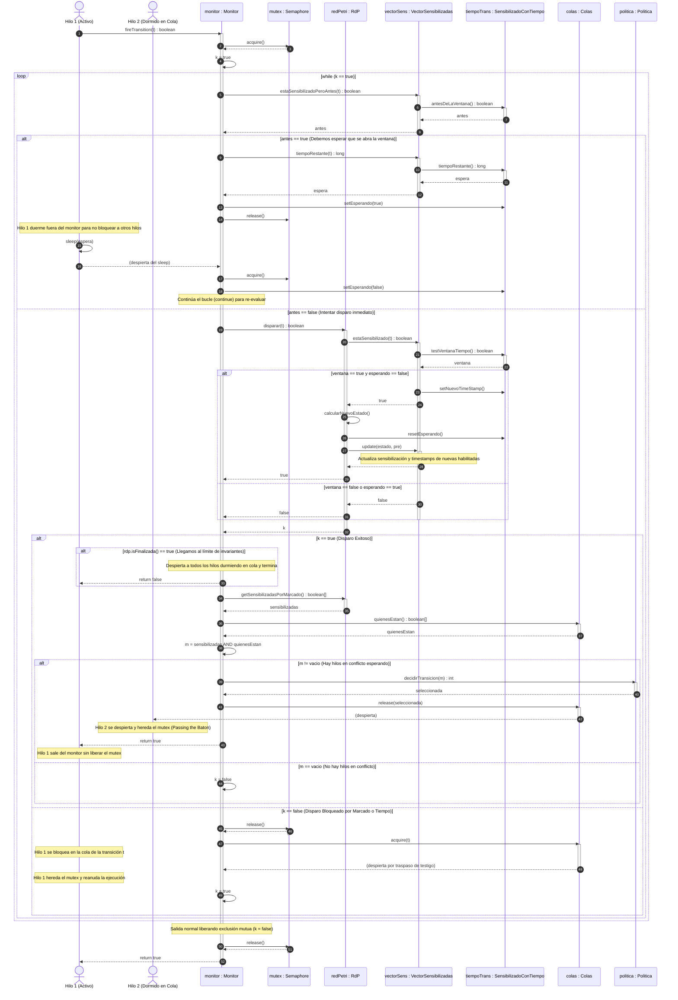

# Diagrama de Secuencia del Monitor de Concurrencia (Ejecución con Tiempo y Políticas)

Este diagrama representa el ciclo de vida del monitor de concurrencia durante la ejecución de la función `fireTransition(t)` de acuerdo con los **Requerimientos 6 y 10** del enunciado, tomando como referencia el diseño y la estructura del proyecto.

Muestra en detalle:
1. La adquisición del `mutex`.
2. La **gestión del tiempo** (espera en transiciones temporales durmiendo fuera del monitor para liberar la exclusión mutua, y posterior reingreso).
3. El intento de disparo en la Red de Petri (`RdP`), incluyendo la verificación de la ventana temporal.
4. El cálculo de la plaza de conflicto `m = sensibilizadas AND quienesEstan`.
5. El uso de la `Politica` para resolver conflictos de hilos encolados en transiciones sensibilizadas mediante `decidirTransicion(m)`.
6. El traspaso de testigo (*Passing the Baton*), despertando hilos en cola sin liberar el mutex.
7. El bloqueo en la cola de la transición si el disparo no es factible en ese instante.

