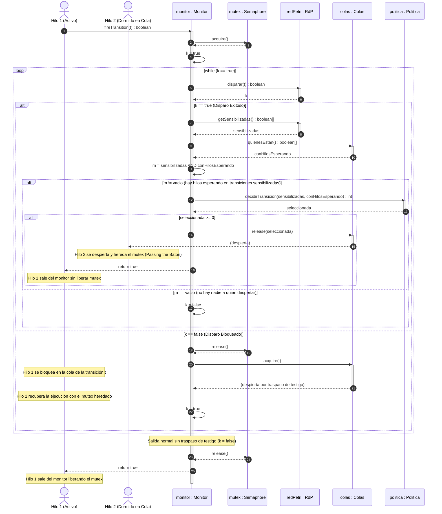

# Diagrama de Secuencia del Monitor de Concurrencia (Ejecución de un Disparo con Políticas)

Este diagrama representa el modelo del monitor de concurrencia durante la ejecución de la función `fireTransition(t)` de acuerdo con el **Requerimiento 6** del enunciado. Muestra la adquisición del `mutex`, el intento de disparo en la Red de Petri (`RdP`), el uso de la `Politica` para resolver conflictos de hilos encolados en transiciones sensibilizadas, el traspaso de testigo (*Passing the Baton*), y el bloqueo en la cola de la transición si el disparo no es posible.

