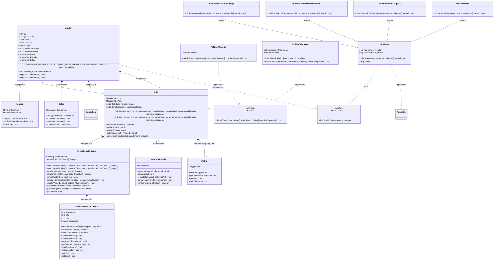

```mermaid
classDiagram
    class MonitorInterface {
        <<interface>>
        +fireTransition(int transition) boolean
    }

    class Monitor {
        -RdP rdp
        -Semaphore mutex
        -Colas colas
        -Politica politica
        -Logger logger
        -int contadorInvariantes
        -int contadorAdmitidas
        -int maxInvariantes
        -int transicionEntrada
        -int transicionSalida
        +Monitor(RdP rdp, Politica politica, Logger logger, int maxInvariantes, int transicionEntrada, int transicionSalida)
        +fireTransition(int transition) boolean
        -despertarATodosYSalir() void
        -despertarATodosYSalir() void
    }

    class Logger {
        -String archivoPath
        -BufferedWriter writer
        +Logger(String archivoPath)
        +escribirDisparo(int transition) void
        +cerrarLog() void
    }

    class Colas {
        -Semaphore[] semaforos
        +Colas(int cantidadTransiciones)
        +acquire(int transition) void
        +release(int transition) void
        +quienesEstan() boolean[]
    }

    class RdP {
        -Matrizi matrizPre
        -Matrizi matrizPost
        -VectorDeEstado vectorDeEstado
        -VectorSensibilizadas vectorSensibilizadas
        +RdP(Matrizi matrizPre, Matrizi matrizPost, VectorDeEstado estadoInicial, VectorSensibilizadas vectorSensibilizadas)
        +RdP(Matrizi matrizPre, Matrizi matrizPost, VectorDeEstado estadoInicial, VectorSensibilizadas vectorSensibilizadas)
        +disparar(int transition) boolean
        +getMatrizPre() Matrizi
        +getMatrizPost() Matrizi
        +getEstadoActual() VectorDeEstado
        +getVectorSensibilizadas() VectorSensibilizadas
    }

    class Matrizi {
        -int[][] matrix
        +Matrizi(int[][] matrix)
        +getColumna(int transition) int[]
        +getFilas() int
        +getColumnas() int
    }

    class VectorDeEstado {
        -int[] marcado
        +VectorDeEstado(int[] marcadoInicial)
        +getMarcado() int[]
        +restarColumna(int[] columnaPre) void
        +sumarColumna(int[] columnaPost) void
        +verificarInvariantePlazas() boolean
    }

    class VectorSensibilizadas {
        -boolean[] sensibilizadas
        -SensibilizadoConTiempo[] tiempos
        +VectorSensibilizadas(int cantidadTransiciones, SensibilizadoConTiempo[] tiempos)
        +VectorSensibilizadas(int cantidadTransiciones, SensibilizadoConTiempo[] tiempos)
        +estaSensibilizado(int transition) boolean
        +estaSensibilizadoPeroAntes(int transition) boolean
        +tiempoRestante(int transition) long
        +actualiceSensibilizadoT(int transition, boolean nuevoEstado) void
        +update(VectorDeEstado estado, Matrizi matrizPre) void
        +sensibilizadaPorMarcado(int transition) boolean
        +getTiempo(int transition) SensibilizadoConTiempo
        +getCantidad() int
    }

    class SensibilizadoConTiempo {
        -long timeStamp
        -long alfa
        -long beta
        -boolean esperando
        +SensibilizadoConTiempo(long alfa, long beta)
        +testVentanaTiempo() boolean
        +antesDeLaVentana() boolean
        +tiempoRestante() long
        +tiempoRestante() long
        +setNuevoTimeStamp() void
        +setEsperando(boolean esp) void
        +resetEsperando() void
        +isEsperando() boolean
        +getAlfa() long
        +getBeta() long
    }

    class Politica {
        <<interface>>
        +decidirTransicion(boolean[] habilitadas, boolean[] conHilosEsperando) int
    }

    class PoliticaAleatoria {
        -Random random
        +decidirTransicion(boolean[] habilitadas, boolean[] conHilosEsperando) int
    }

    class PoliticaPriorizada {
        -int[] transicionesPrioritarias
        -Random random
        +PoliticaPriorizada(int[] transicionesPrioritarias)
        +decidirTransicion(boolean[] habilitadas, boolean[] conHilosEsperando) int
    }

    class HiloBase {
        #MonitorInterface monitor
        #int[] transicionesAsignadas
        +HiloBase(MonitorInterface monitor, int[] transiciones)
        +run() void
    }

    class HiloGenerador {
        +HiloGenerador(MonitorInterface monitor, int[] transiciones)
    }

    class HiloProcesadorTarjetas {
        +HiloProcesadorTarjetas(MonitorInterface monitor, int[] transiciones)
    }

    class HiloProcesadorTransferencias {
        +HiloProcesadorTransferencias(MonitorInterface monitor, int[] transiciones)
    }

    class HiloProcesadorAltoRiesgo {
        +HiloProcesadorAltoRiesgo(MonitorInterface monitor, int[] transiciones)
    }

    %% Relaciones
    Monitor ..|> MonitorInterface : implementa
    Monitor "1" *-- "1" RdP : composición
    Monitor "1" *-- "1" Semaphore : composición
    Monitor "1" *-- "1" Colas : composición
    Monitor "1" o-- "1" Politica : agregación
    Monitor "1" o-- "1" Logger : agregación
    
    PoliticaAleatoria ..|> Politica : implementa
    PoliticaPriorizada ..|> Politica : implementa
    
    RdP "1" *-- "2" Matrizi : composición (Pre y Post)
    RdP "1" *-- "1" VectorDeEstado : composición
    RdP "1" *-- "1" VectorSensibilizadas : composición
    
    VectorSensibilizadas "1" *-- "*" SensibilizadoConTiempo : composición
    
    HiloBase ..|> Runnable : implementa
    HiloBase ..> MonitorInterface : usa
    HiloGenerador --|> HiloBase : hereda
    HiloProcesadorTarjetas --|> HiloBase : hereda
    HiloProcesadorTransferencias --|> HiloBase : hereda
    HiloProcesadorAltoRiesgo --|> HiloBase : hereda
```