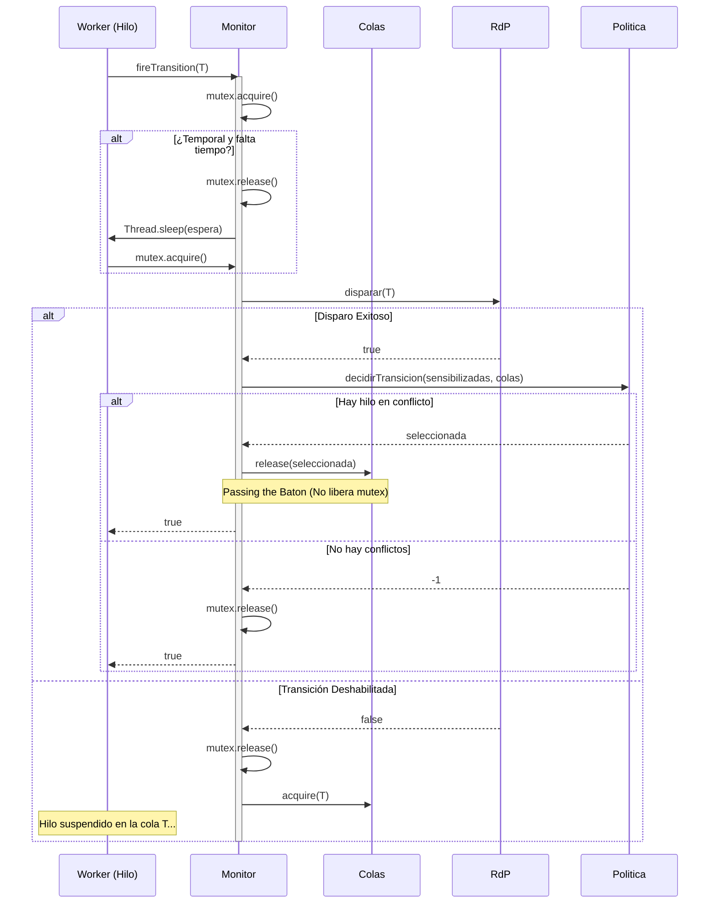

# Resumen Detallado del Código del TP Final
Este documento proporciona una explicación exhaustiva y detallada de la arquitectura, diseño y responsabilidades de cada clase del software implementado en el paquete `monitor`.

---

## 1. Núcleo de Concurrencia y Sincronización

### `MonitorInterface.java`
*   **Responsabilidad:** Define el contrato público del monitor de concurrencia. Funciona como una barrera de abstracción para que los hilos no accedan a métodos internos de administración.
*   **Métodos Principales:**
    *   `boolean fireTransition(int transition)`: Único punto de entrada para solicitar el disparo de una transición. Retorna `true` si el disparo fue exitoso (o si el hilo despertó para continuar), y `false` si el sistema ha finalizado.

### `Monitor.java`
*   **Responsabilidad:** Implementa la exclusión mutua, la temporización de transiciones, la selección de políticas de conflicto y la parada segura del sistema. Es una clase agnóstica a la red de Petri específica (toda la lógica se basa en dimensiones matriciales inyectadas).
*   **Atributos Clave:**
    *   `rdp`: La instancia matemática de la Red de Petri.
    *   `mutex`: Un `Semaphore(1, true)` que garantiza la exclusión mutua del monitor con orden justo (fairness).
    *   `colas`: Estructura que suspende a los hilos cuando las transiciones no están habilitadas.
    *   `politica`: Estrategia inyectada para decidir a qué hilo despertar.
    *   `contadorInvariantes` y `maxInvariantes`: Contadores para detener la simulación al alcanzar 200 transacciones de salida.
*   **Métodos Principales y Lógica:**
    *   `fireTransition(int transition)`:
        1. Adquiere el `mutex` principal.
        2. Entra en un bucle `while` controlado por el estado de disparo.
        3. Si la transición es temporal y no transcurrió el tiempo mínimo ($\alpha$), calcula la espera restante, libera el `mutex` y duerme el hilo mediante `Thread.sleep` (fuera del monitor para no bloquear el sistema). Al despertar, vuelve a adquirir el `mutex` y reevalúa.
        4. Intenta disparar la transición en la `rdp`.
        5. **Si dispara con éxito:** Registra el disparo en el `Logger`, incrementa el contador de invariantes si corresponde, valida los invariantes de plaza, determina qué transiciones con hilos esperando quedaron habilitadas, consulta a la `Politica` para seleccionar una de ellas y ejecuta `colas.release(seleccionada)`. En este punto, **retorna `true` inmediatamente sin liberar el mutex principal** (semántica *Passing the Baton*).
        6. **Si no puede disparar:** Libera el `mutex` principal y se bloquea en la cola correspondiente llamando a `colas.acquire(transition)`. Al ser despertado por otro hilo, vuelve al principio del bucle a reintentar.
    *   `despertarATodosYSalir()`: Bucle que realiza un `release()` sobre cada semáforo de las colas y libera el `mutex` principal para desencadenar el apagado del sistema en cascada.

### `Colas.java`
*   **Responsabilidad:** Gestiona las colas de espera del monitor asociadas a cada transición de la red.
*   **Atributos Clave:**
    *   `semaforos`: Un arreglo de `Semaphore[]` inicializados en $0$ con política de equidad (`true`), uno para cada transición.
*   **Métodos Principales:**
    *   `void acquire(int transition)`: Bloquea al hilo actual en el semáforo correspondiente a la transición indicada.
    *   `void release(int transition)`: Despierta a un hilo bloqueado en el semáforo de la transición.
    *   `boolean[] quienesEstan()`: Retorna un vector booleano indicando en qué transiciones hay hilos esperando actualmente (`hasQueuedThreads()`).

---

## 2. Representación de la Red de Petri (Matemática y Estado)

### `RdP.java`
*   **Responsabilidad:** Modela la red de Petri pura. Realiza las operaciones matemáticas de disparo y actualiza el estado de marcado del sistema.
*   **Atributos Clave:**
    *   `matrizPre` y `matrizPost`: Las matrices de pre-condiciones y post-condiciones.
    *   `vectorDeEstado`: El marcado de plazas actual.
    *   `vectorSensibilizadas`: Estructura que mantiene el estado de habilitación de la red.
*   **Métodos Principales:**
    *   `boolean disparar(int transition)`: Comprueba si la transición está sensibilizada. De ser así, resta el vector de pre-condiciones de la transición al estado, suma el vector de post-condiciones, resetea el estado de espera del tiempo de la transición, actualiza la sensibilización general de toda la red y retorna `true`. Si no está sensibilizada, retorna `false`.

### `Matrizi.java`
*   **Responsabilidad:** Wrapper utilitario para simplificar operaciones matriciales sobre tipos primitivos `int[][]`.
*   **Métodos Principales:**
    *   `int[] getColumna(int col)`: Extrae y retorna una columna específica como un arreglo unidimensional (`int[]`), representando las conexiones de una transición hacia todas las plazas.

### `VectorDeEstado.java`
*   **Responsabilidad:** Almacena la cantidad de tokens por plaza y audita el cumplimiento de las invariantes dinámicas del sistema.
*   **Atributos Clave:**
    *   `marcado`: Arreglo `int[]` con el número de tokens en cada una de las 10 plazas (`P0` a `P9`).
*   **Métodos Principales:**
    *   `void restarColumna(int[] col)` y `void sumarColumna(int[] col)`: Realizan la suma y resta vectorial del disparo.
    *   `boolean verificarInvariantePlazas()`: Evalúa dinámicamente las tres ecuaciones de invariantes de plazas:
        1. $M(P_2) + M(P_3) + M(P_4) + M(P_7) = 1$
        2. $M(P_4) + M(P_5) + M(P_6) + M(P_8) = 1$
        3. $M(P_0) + M(P_1) + M(P_2) + M(P_3) + M(P_4) + M(P_5) + M(P_6) + M(P_9) = 3$
        Retorna `true` si todas las ecuaciones se cumplen con exactitud, de lo contrario retorna `false`.

### `VectorSensibilizadas.java`
*   **Responsabilidad:** Determina el estado de habilitación lógico y temporal de todas las transiciones.
*   **Atributos Clave:**
    *   `sensibilizadasMarcado`: Arreglo de booleanos que indica si una transición tiene suficientes tokens de entrada en sus plazas de origen.
    *   `tiempos`: Arreglo de instancias de `SensibilizadoConTiempo` para controlar los delays temporales.
*   **Métodos Principales:**
    *   `void update(VectorDeEstado estado, Matrizi pre)`: Evalúa la pre-condición lógica para cada transición. Si una transición pasa de estar deshabilitada a habilitada, notifica a su objeto temporal para registrar el timestamp de habilitación.
    *   `boolean estaSensibilizadoPeroAntes(int transition)`: Evalúa si la transición está habilitada por marcado pero el tiempo transcurrido es menor al delay mínimo $\alpha$.
    *   `long tiempoRestante(int transition)`: Calcula en milisegundos cuánto tiempo le falta al hilo para poder disparar la transición.

### `SensibilizadoConTiempo.java`
*   **Responsabilidad:** Modela la temporización individual de una transición según una ventana $[\alpha, \beta]$.
*   **Atributos Clave:**
    *   `alpha` y `beta`: Límites temporales en milisegundos.
    *   `timestampHabilitacion`: Momento exacto (`System.currentTimeMillis()`) en el que la transición se habilitó.
    *   `esperando`: Bandera booleana que indica si hay un hilo durmiendo temporalmente para cumplir el delay de esta transición.
*   **Métodos Principales:**
    *   `void setTimestampHabilitacion(long time)`: Registra el inicio de la habilitación.
    *   `boolean estaEnVentana()`: Evalúa si el tiempo transcurrido desde la habilitación está dentro del rango $[\alpha, \beta]$.
    *   `long getTiempoRestante()`: Retorna el delay faltante para alcanzar el umbral $\alpha$.

---

## 3. Resolución de Conflictos (Políticas)

### `Politica.java`
*   **Responsabilidad:** Define la interfaz Strategy para seleccionar cuál transición despertar cuando hay conflicto.
*   **Métodos Principales:**
    *   `int decidirTransicion(boolean[] habilitadas, boolean[] conHilosEsperando)`: Evalúa la disponibilidad y decide qué índice de transición despertar. Retorna `-1` si no hay candidatos.

### `PoliticaAleatoria.java`
*   **Responsabilidad:** Resuelve conflictos de forma aleatoria y equitativa.
*   **Métodos Principales:**
    *   `int decidirTransicion(...)`: Recorre todas las transiciones. Si una transición está sensibilizada y posee hilos esperando en su cola, la agrega a una lista de candidatas. Retorna un elemento de esta lista seleccionado al azar mediante `java.util.Random`.

### `PoliticaPriorizada.java`
*   **Responsabilidad:** Implementa la política de negocio priorizando el flujo de alto riesgo (las transiciones `T4` y `T5`).
*   **Métodos Principales:**
    *   `int decidirTransicion(...)`: Evalúa primero si las transiciones críticas (`T4` o `T5`) están sensibilizadas y tienen hilos esperando. De ser así, selecciona prioritariamente una de ellas. Si no hay candidatos prioritarios, delega la decisión a la lógica aleatoria como fallback.

---

## 4. Hilos de Ejecución (Workers)

### `HiloBase.java`
*   **Responsabilidad:** Superclase abstracta que define el esqueleto de ejecución de los hilos de la aplicación.
*   **Atributos Clave:**
    *   `monitor`: La interfaz del monitor compartido.
    *   `transiciones`: Arreglo de índices de las transiciones asignadas al hilo.
*   **Métodos Principales:**
    *   `run()`: Ejecuta un bucle infinito. En cada iteración, recorre secuencialmente su arreglo de transiciones e intenta dispararlas llamando a `monitor.fireTransition(t)`. Si la llamada retorna `false`, se rompe el ciclo y el hilo finaliza limpiamente.

### `HiloGenerador.java`
*   **Responsabilidad:** Implementa el hilo de extremos del ciclo de vida. Se instancia tanto para disparar la admisión (`T0`) como para la liquidación final (`T9`).

### `HiloProcesadorTarjetas.java`
*   **Responsabilidad:** Worker asignado al flujo de tarjetas. Intenta disparar de forma secuencial y ordenada las transiciones `T1` $\rightarrow$ `T2` $\rightarrow$ `T3`.

### `HiloProcesadorAltoRiesgo.java`
*   **Responsabilidad:** Worker asignado al flujo de alto riesgo. Intenta disparar secuencialmente `T4` $\rightarrow$ `T5`.

### `HiloProcesadorTransferencias.java`
*   **Responsabilidad:** Worker asignado al flujo bancario. Intenta disparar secuencialmente `T6` $\rightarrow$ `T7` $\rightarrow$ `T8`.

---

## 5. Utilidades y Registro

### `Logger.java`
*   **Responsabilidad:** Registra de forma segura, sincronizada e inalterable el historial de disparos del sistema.
*   **Métodos Principales:**
    *   `synchronized void escribirDisparo(int transition)`: Escribe una línea con el formato `T<n> <timestamp_ms>` en el archivo `log_disparos.txt` y fuerza el vaciado del buffer (`flush`) para asegurar la consistencia del archivo en disco.

---

## 6. Flujo de Control Concurrente (Ejemplo de Ejecución)

1.  **Ingreso:** El hilo llama a `fireTransition(T)` y adquiere el semáforo `mutex` principal.
2.  **Validación Temporal:** Si la transición es temporizada y no se cumplió el tiempo mínimo ($\alpha$), el hilo sale del monitor liberando el `mutex` y duerme mediante `Thread.sleep()`. Al despertar, vuelve a adquirir el `mutex` e intenta de nuevo.
3.  **Disparo:** Si la transición está sensibilizada, la Red de Petri (`RdP`) calcula algebraicamente el nuevo marcado.
4.  **Traspaso del Testigo (Passing the Baton):**
    *   Si el disparo es exitoso, el monitor analiza qué transiciones tienen hilos esperando en sus semáforos de `Colas`.
    *   La `Politica` decide a cuál despertar.
    *   Si hay un hilo esperando, el monitor hace `colas.release(seleccionada)` y retorna `true` **sin liberar el mutex principal**. El hilo despertado hereda directamente la exclusión mutua.
    *   Si no hay hilos esperando, el monitor libera el `mutex` principal mediante `mutex.release()` y el hilo actual sale con `true`.
5.  **Bloqueo:** Si la transición no estaba habilitada inicialmente, el monitor libera el `mutex` principal y suspende al hilo llamando a `colas.acquire(T)`. Al ser reactivado en el futuro por otro hilo mediante la transferencia de testigo, reevalúa el disparo.
